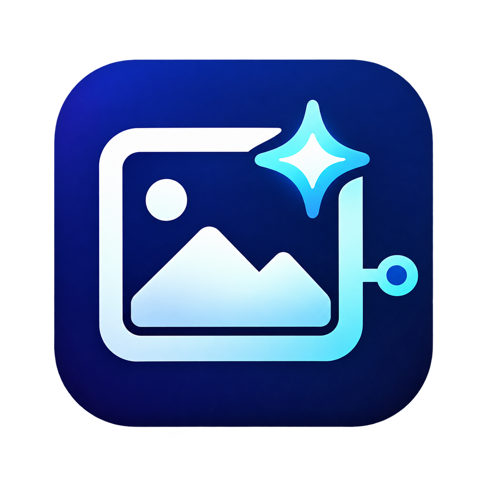

<p align="center">
  
</p>

# image-gen-mcp

A local Model Context Protocol (MCP) server for generating and editing images
through your own Azure Foundry deployment, with GitHub Copilot and editable
presentation workflows.

**Status: source-build preview, not a published npm release.** The implemented
tools have [real Azure evidence](docs/evidence/azure-contract.md),
[actual Copilot CLI evidence](docs/evidence/copilot-cli.md) and a
[rendered presentation example](docs/evidence/presentation.md).
Verified paths include local macOS / Node 22.22.2 / Copilot CLI 1.0.79 and
the CLI-backed VS Code 1.139.0 session with CLI-token generation/editing from
an installed tarball. Native Local Copilot Chat has a demonstrated preview-off
recovery/edit workflow; inline previews encountered a host image-transport
failure. Do not equate the two session backends.
See the [qualification matrix and boundaries](docs/evidence/client-qualification.md).
A separate [data-only Azure principal](docs/evidence/data-only-authentication.md)
also generated and edited while an authenticated management read was denied.
Live expired-session behavior remains unverified; ambiguous diagnostics do not
claim a unique cause. npm publication remains an
[open gate](https://github.com/juanmicrosoft/image-gen-mcp/milestone/1).

The configured model profile is `gpt-image-2.5-sunburst`. V1 deliberately enables
only the live-verified **1536x864, high-quality PNG** combination: one image,
one concurrent submission, no automatic retries, prompt rewrites or model
fallback. No exact ChatGPT backend or output parity is claimed.

| Tool | Purpose |
| --- | --- |
| `get_capabilities` | Nonbillable diagnostics; keeps configured, observed and unverified facts separate |
| `generate_image` | One new immutable image, identified by a caller-retained operation UUID |
| `edit_image` | One explicit artifact or approved local PNG reference; immutable parent/child lineage |
| `get_operation` | Recover a saved result after interruption without submitting again |

## Get started

For an existing compatible deployment:

```sh
git clone https://github.com/juanmicrosoft/image-gen-mcp.git
cd image-gen-mcp
npm ci
npm run build
```

Then follow [existing-deployment setup](docs/setup.md) to select credentials,
set the inference endpoint/deployment/output directory, and create a private
client configuration. Do not use an unpublished `npx` package or paste a key
into shell history. The server is a stdio protocol process, not an interactive
image-generation command.

Starting from scratch? Use the separate [owner-tagged Bicep/Azure CLI setup](docs/azure-setup.md).
The normal MCP never creates resources or retrieves management keys.
The [authorization record](docs/evidence/authentication.md) explains the required
resource-scoped grant and remaining limits; a token or management access alone
is not inference permission.

Ask Copilot to generate a hero with negative space, inspect it, then explicitly
edit that artifact using a new operation UUID. Results include the immutable
full-resolution path, dimensions, hash, lineage, available usage and an optional
bounded image preview. Image requests are billable; diagnostics are not.

## Presentations, safety and evidence

The [PptxGenJS example](examples/presentation/README.md) consumes full-resolution
artifacts into three editable slides. Its dependencies stay outside the runtime.
Reference continuity is probabilistic; generated art does not replace editable text.

Read [configuration](docs/configuration.md), [client setup/limits](docs/clients.md),
[generation](docs/generation.md), [editing](docs/editing.md),
[privacy/cost/recovery](docs/operations.md) and [bounded live evaluation](docs/evaluation.md).
Previews can be disabled. Cancellation does not prove that a request stopped or
was free; retain the operation ID and inspect it before explicitly submitting again.

For contributors, `npm test` is offline and requires no Azure credentials.
See [testing](docs/testing.md), [CONTRIBUTING.md](CONTRIBUTING.md) and
[AGENTS.md](AGENTS.md) for the individual-PR, independent-review and evidence rules.
The [candidate changelog](CHANGELOG.md) and [release evidence/gates](docs/release.md)
separate passed offline/package CI from unresolved live-client and publication acceptance.

The software and documentation are [MIT licensed](LICENSE). See
[SECURITY.md](SECURITY.md). This license
does not replace Azure/OpenAI service terms or guarantee rights in generated
images or third-party source assets.
